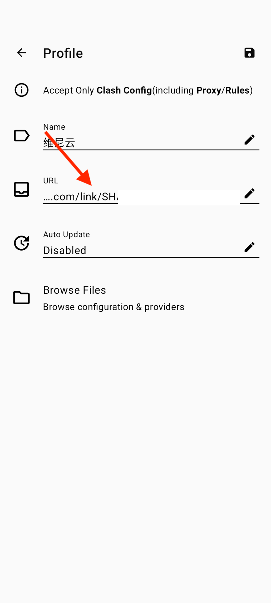
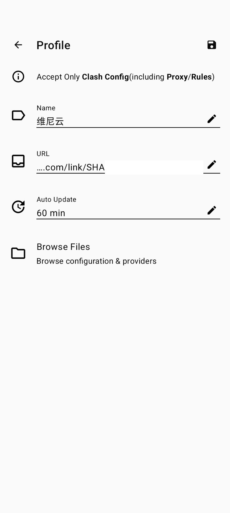
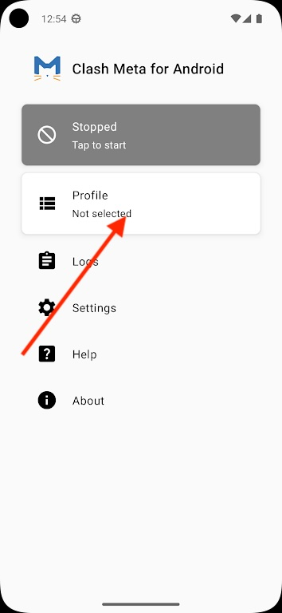
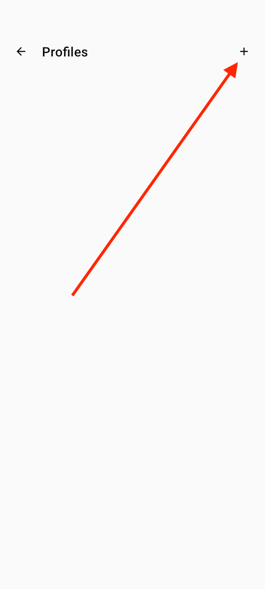
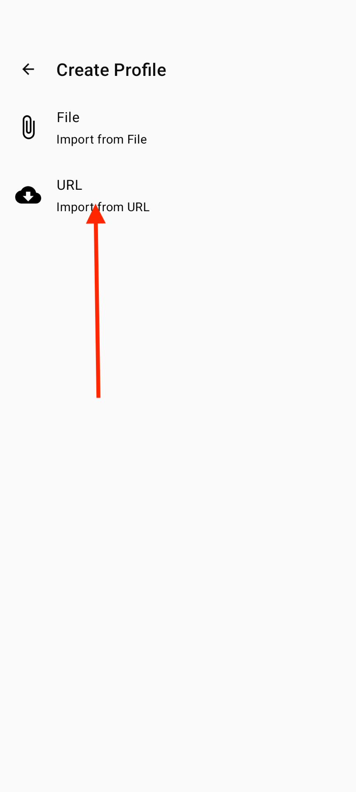
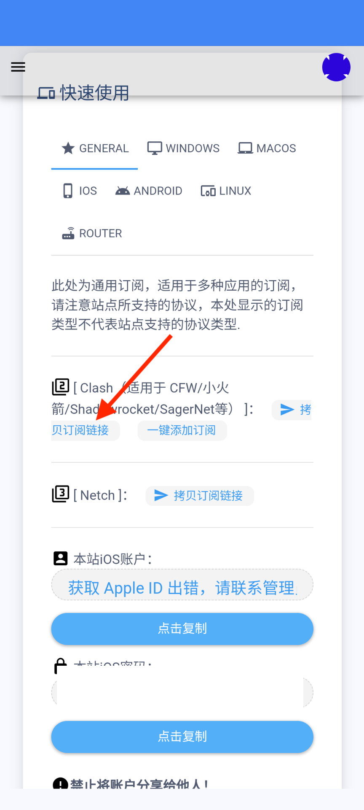
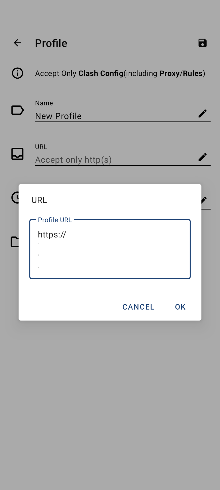
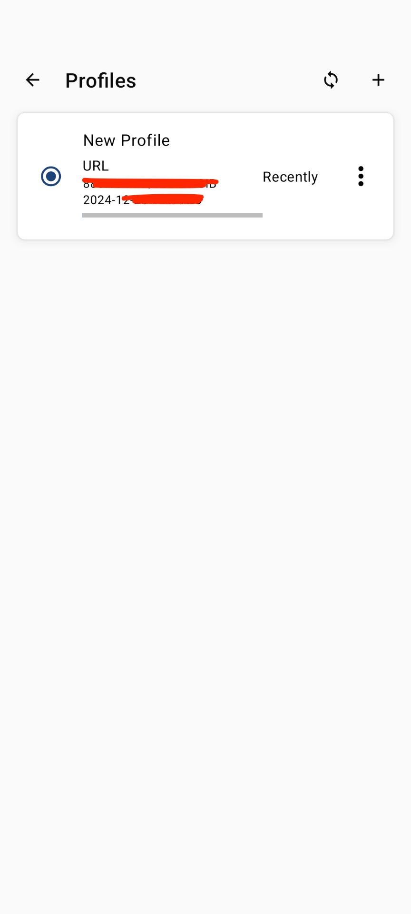
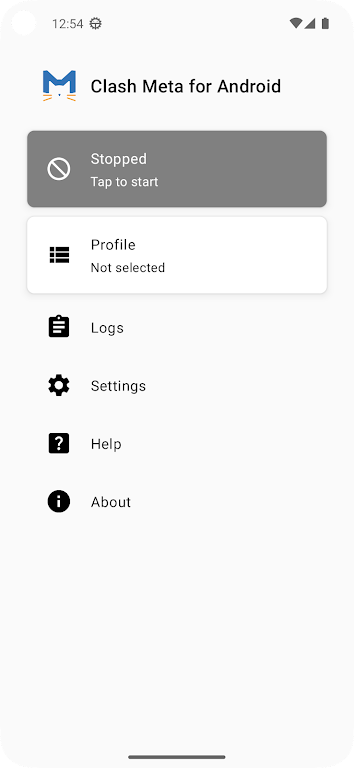

# Harmony 使用教程

## 1. 下载客户端

[下载 Clash Meta for Harmony 客户端](https://github.com/MetaCubeX/ClashMetaForAndroid/releases/download/v2.11.2/cmfa-2.11.2-meta-universal-release.apk)

## 2. 添加配置文件

### 自动添加配置文件（推荐）

1. 打开[用户中心](https://winnie.cloud/user)

2. 在页面最底端，找到 `[ Clash（适用于 CFW/小火箭/Shadowrocket/SagerNet等） ]：` 点击 `一键添加订阅`

   {width=400 height=702}

3. 如果浏览器提示是否允许打开 Clash Meta for Android , 点击允许，会自动跳转到软件并填写好相应参数，点击自动更新，将自动更新时间调整为 60 分钟，并点击右上角按钮进行保存

   {loading=lazy width=412 height=728}
   {loading=lazy width=412 height=728}

   

### 手动添加配置文件

如果你在自动添加配置文件时遇到问题，可以使用以下方法手动进行添加：

1. 打开刚刚下载安装的软件，点击Profile

   {loading=lazy width=412 height=728}

2. 点击右上角的小 + 号

   {loading=lazy width=412 height=728}

3. 选择从 URL 导入

   {loading=lazy width=412 height=728}

4. 打开[用户中心](https://winnie.cloud/user)

5. 在页面最底端，找到 `[ Clash（适用于 CFW/小火箭/Shadowrocket/SagerNet等） ]：` 点击拷贝订阅链接

   {loading=lazy width=400 height=702}

6. 返回到之前的页面，将刚刚复制到剪贴板的订阅链接粘贴进 URL 中，并将自动更新时间设置为 60 分钟，最后点击保存按钮

   {loading=lazy width=412 height=728} 
   
   {loading=lazy width=412 height=728}

>  **注意**：您刚刚所复制的链接为重要的连接凭证，泄露此链接至公开区域会导致您的账号损失流量，甚至账号被**封禁**，请妥善使用

## 3. 连接节点使用

1. 选中配置文件中的 `维尼云(或自定义的名称)`，并返回主界面

   {loading=lazy width=412 height=728}

2. 点击灰色的 `Stopped tap to start` 即可连接节点进行使用了

   {loading=lazy width=412 height=728}
