# iOS 使用教程

### 获取共享 Apple ID 账号（如已购买或者安装可跳过）

1. 在[用户中心](https://winnie.cloud/user)底部，选中 Gereral，可以看到共享 Apple ID 账号

   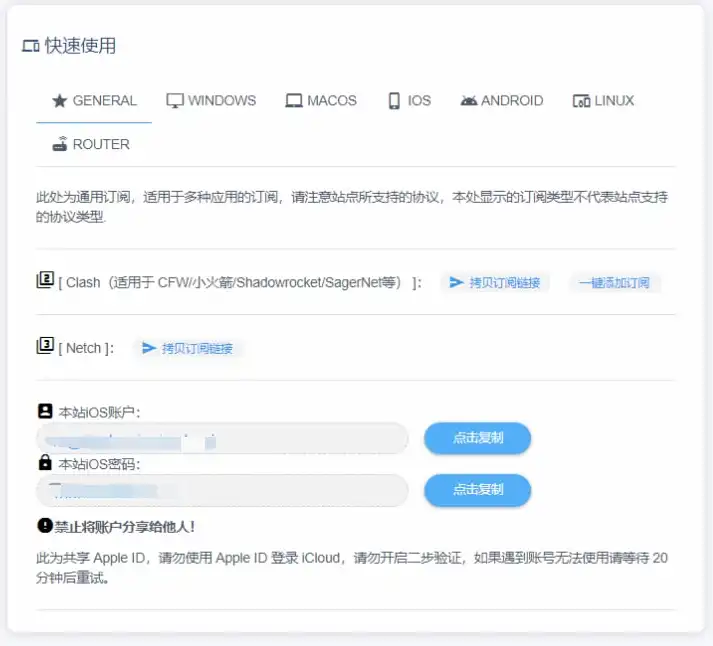{width=713 height=646}

2. 复制账号和密码，打开设置

3. 在设置顶部找到有自己 Apple id 和头像一栏，点击

   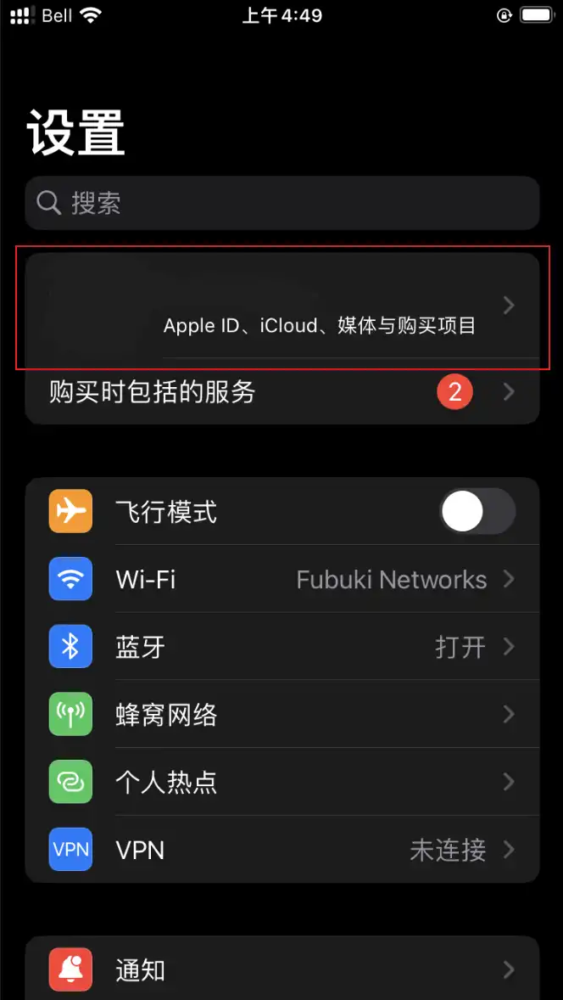{loading=lazy width=664 height=1178}

4. 找到媒体与购买项目一栏，点击并选择不是xxx(你的名字)退出当前登录的 Apple ID ，等待一会儿，再次点击并使用网站上提供的共享 Apple ID 和密码进行登录

   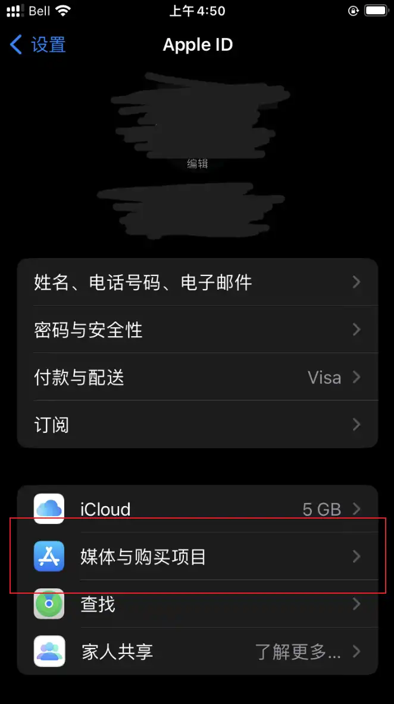{loading=lazy width=662 height=1181}

   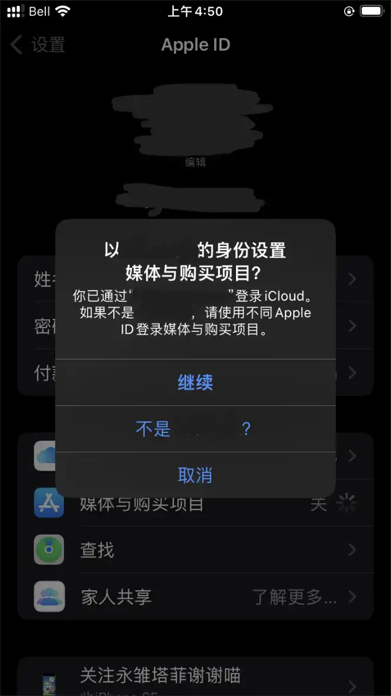{loading=lazy width=666 height=1183}

> 因为账号为共享， 使用上面提供的方法登录共享账号可保证只登录 Appstore 而不是 iCloud，如果直接登录 iCloud 账号可能会导致您手机上的**照片**，**通讯录**等隐私信息被自动上传至 iCloud 并对其他使用此账号的人可见，如果您不小心开启了查找手机功能，甚至可能被恶意用户利用**锁定手机**或**抹除所有数据**！

## 1. 下载 Shadowrocket 客户端

[点击链接跳转到商店](https://apps.apple.com/us/app/shadowrocket/id932747118)，或者打开 App Store 搜索 Shadowrocket 并下载

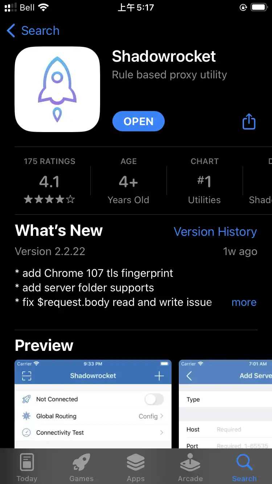{loading=lazy width=750 height=1334}

> 请认准软件图标和名字，建议使用链接打开，目前有一批仿冒软件，收费且并没有任何作用，纯骗钱

## 2. 导入配置文件

### 自动导入配置文件(推荐)

在[用户中心](https://winnie.cloud/user)底部，找到快速使用中的 GENERAL 选项，点击一键添加订阅，在弹出的窗口中点击允许，即可自动跳转到 Shadowrocket 并自动添加好配置文件

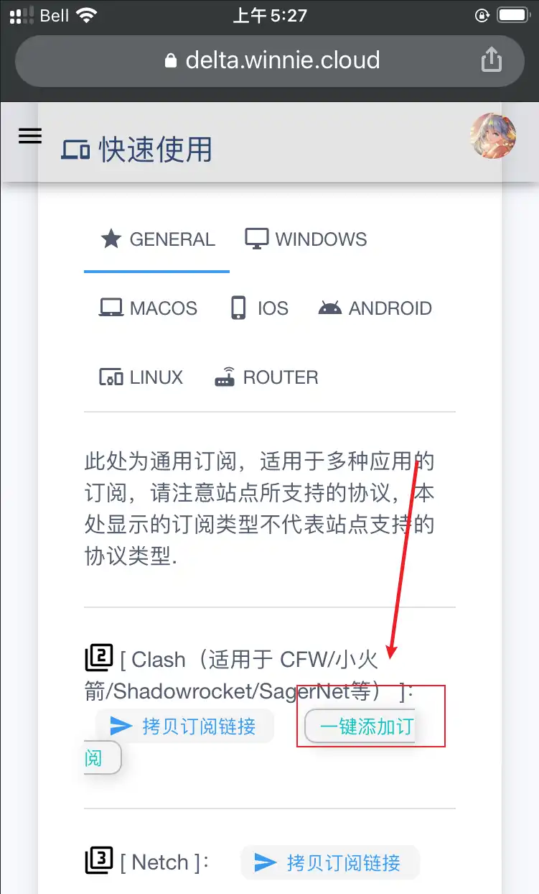{loading=lazy width=751 height=1244}
	
如果添加成功，会在软件中显示刚刚添加好的节点并自动启用

### 手动导入配置文件

如果你在自动添加配置文件时遇到问题，可以使用以下方法手动进行添加：

1. 在[用户中心](https://winnie.cloud/user)底部，找到快速使用中的 GENERAL 选项，点击复制订阅链接

   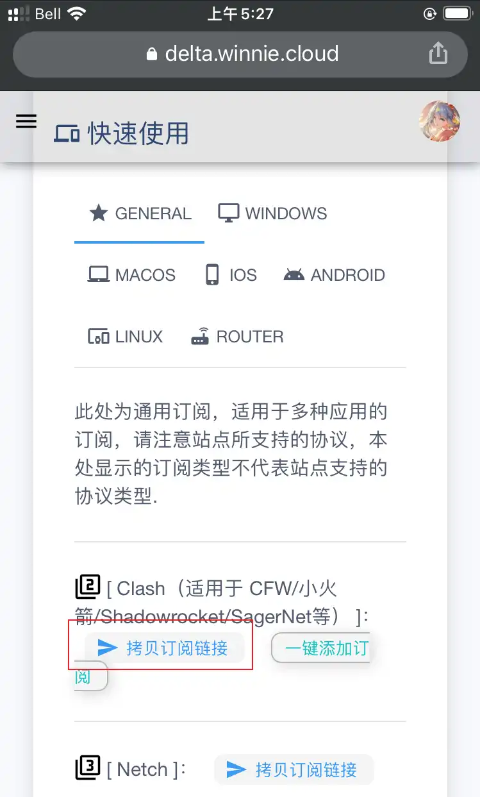{loading=lazy width=749 height=1243}
	
2. 打开刚刚下载的 Shadowrocket, 点击底部的配置一栏，点击添加配置

   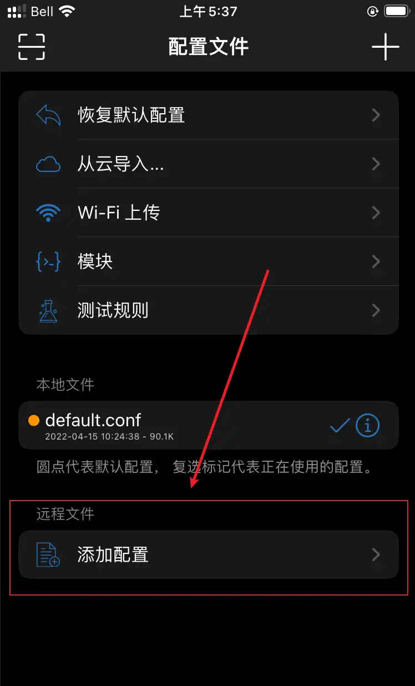{loading=lazy width=748 height=1236}
	
3. 将刚刚复制的链接粘贴进选项框，点击下载

   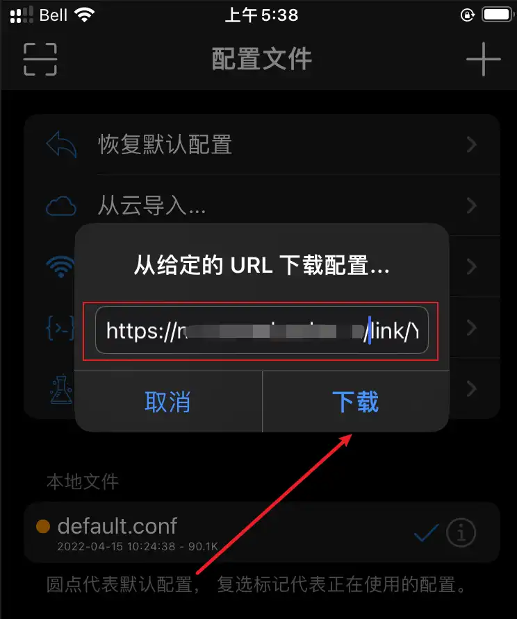{loading=lazy width=744 height=892}

4. 在最下方找到刚刚添加的配置文件，单击，并选择使用配置

   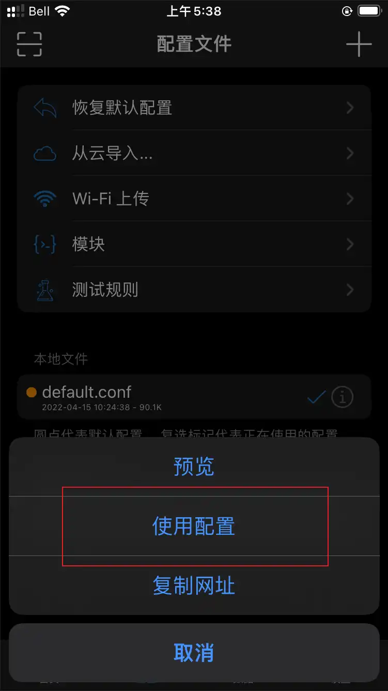{loading=lazy width=751 height=1336}
	
5. 待下载完成后，会自动选择刚刚的配置文件

   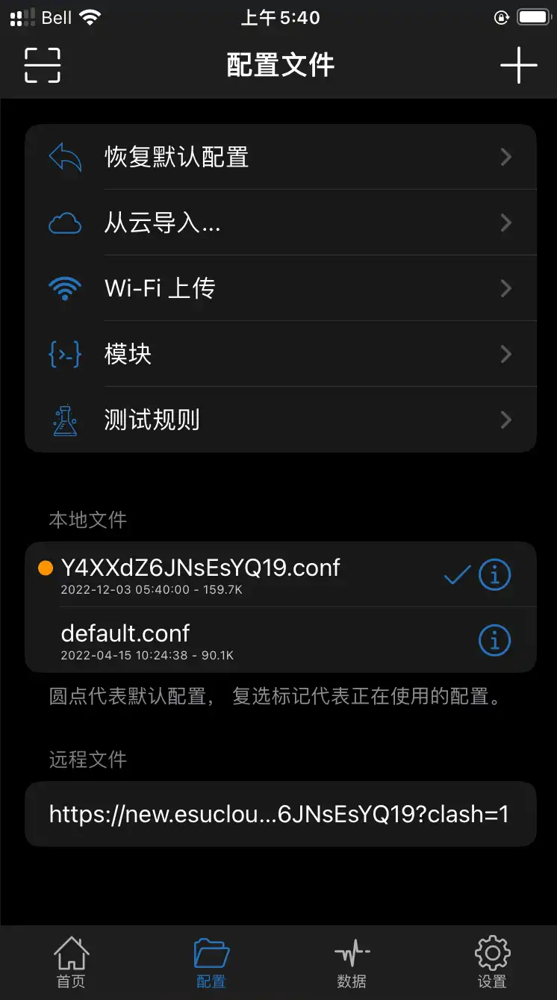{loading=lazy width=746 height=1339}
	
## 3. 开始使用

在主界面，如果全局路由不为配置，单击并将其改为配置，最后点击开关按钮即可开始使用

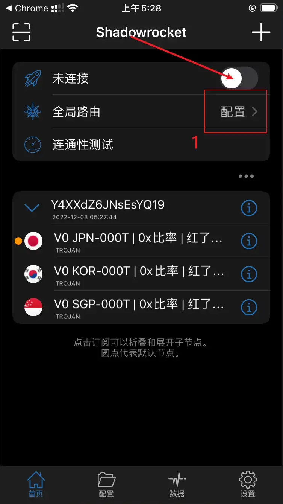{loading=lazy width=753 height=1339}
