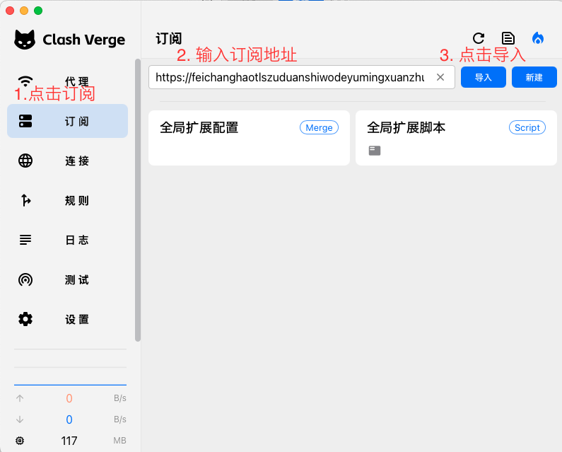

# MacOS 使用教程

## 1. 下载安装客户端

1. 下载Clash Verge Rev Mac客户端, 下载安装包或使用`brew`包管理器:
   - [Clash Verge Rev Mac客户端 Intel芯片](https://github.com/clash-verge-rev/clash-verge-rev/releases/download/v1.7.7/Clash.Verge_1.7.7_x64.dmg)
   - [Clash Verge Rev Mac客户端 Apple M芯片](https://github.com/clash-verge-rev/clash-verge-rev/releases/download/v1.7.7/Clash.Verge_1.7.7_aarch64.dmg)
   - 在`terminal`中运行`brew install --cask clash-verge-rev`安装

2. 安装并授权运行，首次客户端时可能需要手动前往Mac的 **系统偏好设置** – **安全性与隐私性** – **通用** 选项卡，将“**允许从以下位置下载的App**”改为“**任何来源**”，并允许运行下方所列的`Clash Verge` App。

   > Clash Verge Rev客户端支持 Windows, Linux, MacOS 系统

## 2. 安装配置文件
首先打开`Clash Verge` App

### 手动安装配置文件

1. 打开[用户中心](https://winnie.cloud/user)

2. 在页面最底端，找到 `[ Clash（适用于 CFW/小火箭/Shadowrocket/SagerNet等） ]：` 点击 `拷贝订阅链接`

3. 点击 `订阅` 按钮，将刚刚复制的链接粘贴进输入框，点击 `导入` 按钮

   {loading=lazy width=850 height=603}

4. 右键点击刚才导入的订阅，点击使用按钮

   {loading=lazy width=850 height=603}

   > **注意**：您刚刚所复制的链接为重要的连接凭证，泄露此链接至公开区域会导致您的账号损失流量，甚至账号被**封禁**，请妥善使用

## 3. 配置代理模式

进入**代理**界面，选择你需要的代理模式。其中：

- **全局**：所有流量都使用代理
- **规则**：根据配置文件内的规则进行分流，部分流量使用代理，部分流量不使用（推荐此方式）
- **直连**：所有流量都不使用代理

> 在**规则**模式下，点击分组展开按钮可以切换显示所有节点或收起分组。

{loading=lazy width=850 height=603}

## 4 .启动代理

1. 点击 设置 按钮，在右边栏找到 系统代理 选项，点击按钮开启即可上网

   {loading=lazy width=850 height=603}
