# Windows 使用教程

在 Windows 下，您可以选择安装 [Clash](#clash-使用教程)（推荐） 或者 [Netch](#netch-使用教程) 使用维尼云

## Clash 使用教程

### 简介

Clash 是一个使用 Go 语言编写，基于规则的跨平台代理软件核心程序。 Clash for Windows 是运行在 Windows 上的一图形化 Clash 分支。通过 Clash API 来配置和控制 Clash 核心程序，便于用户可视化操作和使用。

### 1. 下载安装客户端

1. [下载 Clash for Windows 客户端](https://github.com/Fndroid/clash_for_windows_pkg/releases/download/0.20.10/Clash.for.Windows-0.20.10-win.7z)
2. 解压下载好的文件
3. 打开解压好的文件夹，找到 `Clash for Windows.exe` 并打开

### 2. 安装配置文件

#### 自动添加配置文件（推荐）

1. 打开[用户中心](https://winnie.cloud/user)

2. 在页面最底端，找到 `[ Clash（适用于 CFW/小火箭/Shadowrocket/SagerNet等） ]：` 点击 `一键添加订阅`

   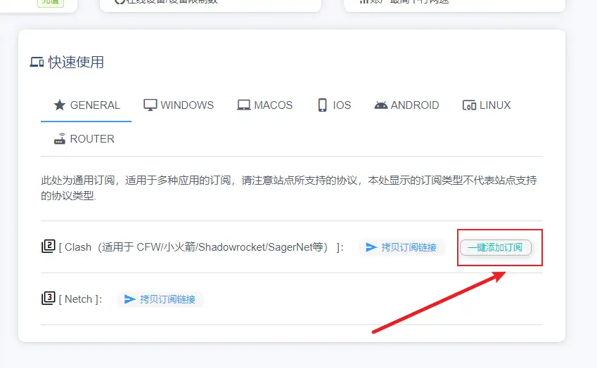{width=849 height=524}

3. 浏览器会提示启动 Clash for Windows 客户端，如果没有自动跳转到 **Profiles** 界面，请手动切换到该界面进行检查。

4. 删除默认的 config.yaml, 点击刚刚下载好的配置文件

   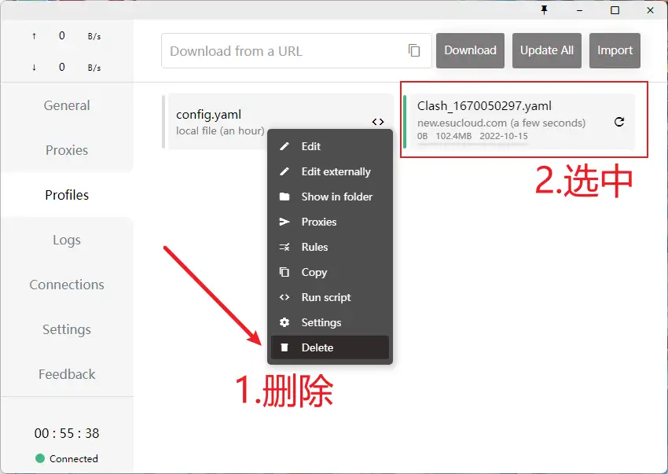{loading=lazy width=850 height=603}

#### 手动安装配置文件

如果你在自动添加配置文件时遇到问题，可以使用以下方法手动进行添加：

1. 打开[用户中心](https://winnie.cloud/user)

2. 在页面最底端，找到 `[ Clash（适用于 CFW/小火箭/Shadowrocket/SagerNet等） ]：` 点击 `拷贝订阅链接`

3. 点击 `Profiles` 按钮，将刚刚复制的链接粘贴进输入框，点击 Download 按钮

   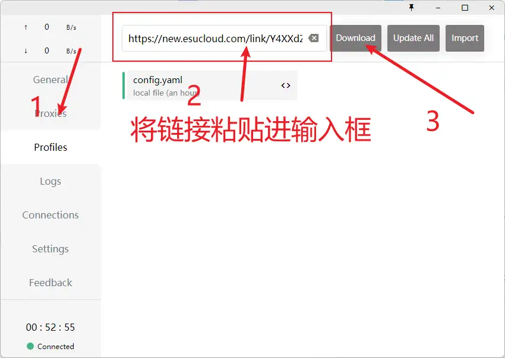{loading=lazy width=850 height=603}

4. 删除默认的 config.yaml, 点击刚刚下载好的配置文件

   {loading=lazy width=850 height=603}

   > **注意**：您刚刚所复制的链接为重要的连接凭证，泄露此链接至公开区域会导致您的账号损失流量，甚至账号被**封禁**，请妥善使用

### 3. 配置代理模式

进入**Proxies**界面，选择你需要的代理模式。其中：

- **Global（全局模式）**：所有流量都使用代理
- **Rule（规则模式）**：根据配置文件内的规则进行分流，部分流量使用代理，部分流量不使用（推荐此方式）
- **Direct（直连模式）**：所有流量都不使用代理
- **Script（脚本模式）**：根据高级脚本来进行分流（不推荐无编程经验用户使用）

> 在**Rule**模式下，点击分组右上角的小眼睛可以切换显示所有节点或收起分组。

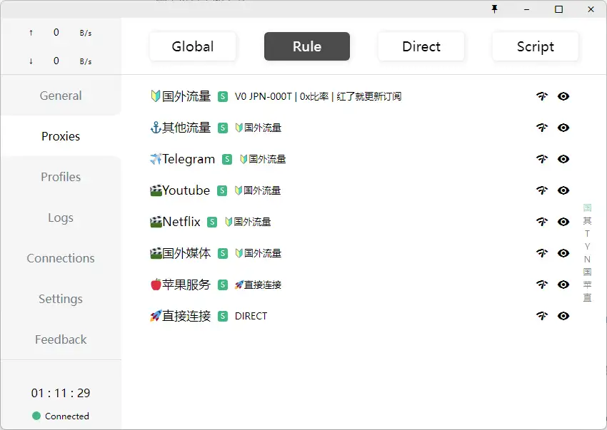{loading=lazy width=850 height=603}

### 4 .启动代理

1. 点击 General 按钮，在右边栏找到 System Proxy 选项，点击按钮开启即可上网

   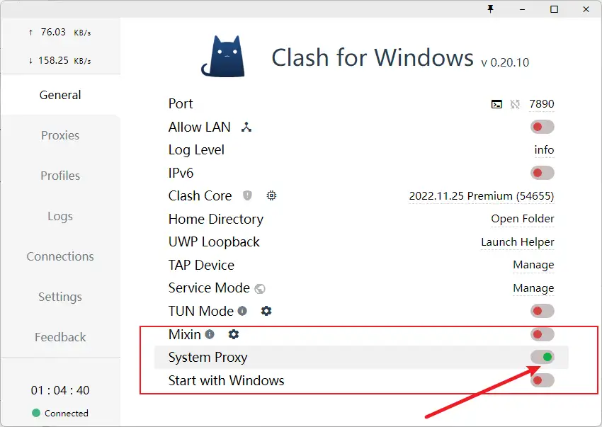{loading=lazy width=850 height=603}

## Netch 使用教程

### 简介

Netch 是一款运行在 Windows 系统上的开源游戏加速工具。也可以用于日常的网页浏览等。配置稍复杂，如果不了解不建议使用

- 不同于SSTap那样需要通过添加规则来实现黑名单代理，Netch原理更类似[Sockscap64](https://www.sockscap64.com/homepage/)，通过扫描游戏目录获得需要代理的进程名进行代理。 也可以实现 [SSTap](https://github.com/mayunbaba2/SSTap-beta-setup) 那样的全局 TUN/TAP 代理，和 [shadowsocks-windows](https://github.com/shadowsocks/shadowsocks-windows) 那样的本地 Socks5，HTTP 和系统代理。
- 在日常网页浏览方面，可以进行分流设置。
- 支持的代理协议：Socks5 / Shadowsocks / ShadowsocksR / Vmess
- UDP NAT FullCone
- 指定进程加速

### 安装 Netch

#### 1.安装 .NET Framework 6.0 运行环境

Netch 要求 .NET 6.0 运行环境，如果你没有安装，或者不知道自己有没有安装，建议按照以下步骤下载安装运行环境

##### 下载安装

- 64 位系统(推荐)：https://dotnet.microsoft.com/en-us/download/dotnet/thank-you/runtime-desktop-6.0.11-windows-x64-installer
- 32 位系统：https://dotnet.microsoft.com/en-us/download/dotnet/thank-you/runtime-desktop-6.0.11-windows-x86-installer
- Arm64: https://dotnet.microsoft.com/en-us/download/dotnet/thank-you/runtime-desktop-6.0.11-windows-arm64-installer

##### Winget

`winget install Microsoft.DotNet.Runtime.6`

#### 安装 Netch

1. [下载 Netch](https://github.com/netchx/netch/releases/download/1.9.7/Netch.7z)

2. 完整解压，并双击运行主程序 Netch.exe 。

   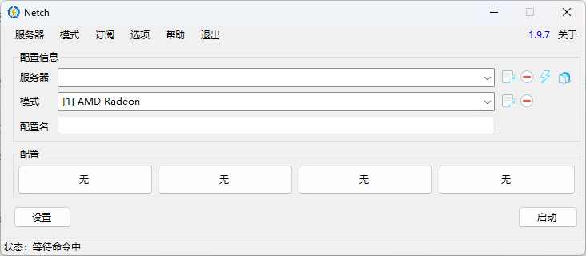

### 导入订阅链接

1. 打开[维尼云用户中心](https://delta.winnie.cloud/user)

2. 找到快速使用一栏，点击 `[ Netch ]` 旁的拷贝订阅链接将订阅链接复制到剪贴板

   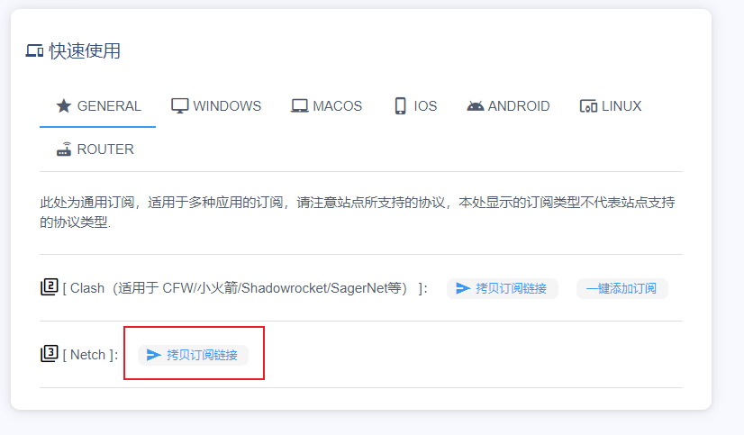

   3. 在顶栏上找到订阅按钮，点击管理订阅

      

   4. 在弹出的窗口中将订阅链接填入`链接`一栏，备注可以填你喜欢的名字

      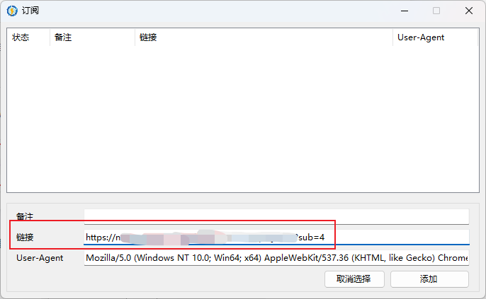

   5. 点击添加按钮，可以看到上方空白区域已经多了一条刚刚添加的订阅

      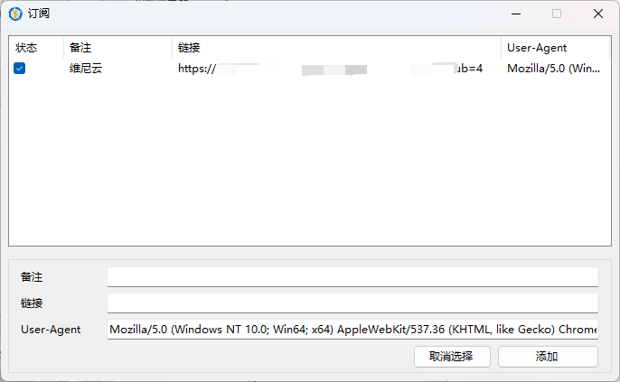

   6. 关闭订阅窗口，再次点击订阅->更新服务器

      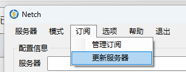

   7. 如果配置正确，应该可以看到节点了，选择你想连接的节点，然后在模式一栏中点击 Bypass Lan and China

      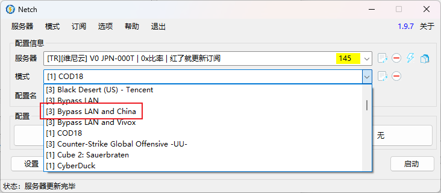

   8. 点击启动，你可以访问国际互联网了

      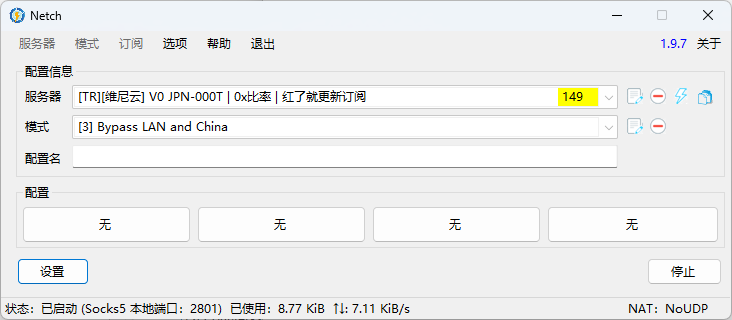

